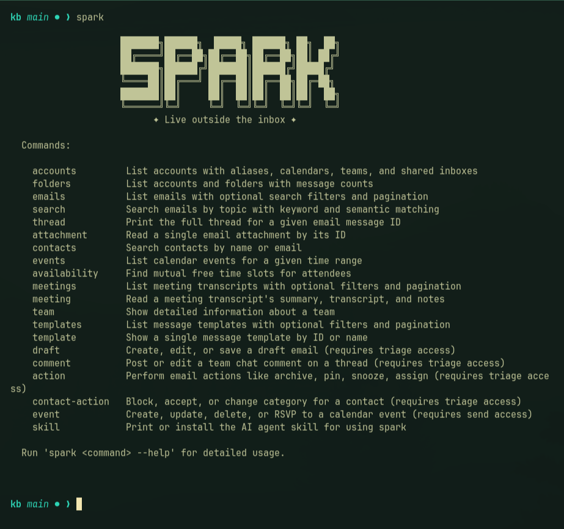

# spark-mail-linux

## TL;DR

Run [Spark Mail](https://sparkmailapp.com/) for Windows on Linux with Wine.
Two small DLL shims prevent known crashes. Scripts handle launch, browser login, and native notifications.

- **Unofficial.** Readdle does not support this project.
- **Verified:** Spark 3.30.12.140844 starts on Arch Linux with Wine 11.16 and 11.17.
- **CLI:** The bundled Windows CLI works through [bin/spark](bin/spark). Spark Desktop must remain open.
- **Updates:** Follow the [update procedure](AGENTS.md#update-spark), not Spark’s update button.


## Install

See [INSTALLATION.md](INSTALLATION.md) for full instructions, verification steps, caveats, and troubleshooting.
The recommended way to install is to give this repository to a coding agent. The installation document is written for that.

The short path on Arch Linux:

1. Download the official Windows `Spark.exe`. Confirm the current version and URL on the [release notes](https://sparkmailapp.com/spark3/win/changelog).
2. Run `./install.sh /path/to/Spark.exe` from the repository root.
3. Launch with `./run-spark.sh`. Use that command for later launches too.

The app and Wine state stay in this directory. The installer adds a normal
application launcher and registers Spark's URL handler with your desktop.

After Spark's renderer is ready, the launcher closes Wine's `explorer.exe`
desktop helper so the tray icon does not remain as a small standalone window.

## What works

Login, inbox, calendar, mail delivery, attachments, and notifications were tested on Spark 3.30.10 and 3.30.11.
Version 3.30.12 has passed desktop startup checks. Its mail, calendar, and attachment operations still need separate checks.

Bubblewrap contains filesystem writes but retains network and display access. It is not a security sandbox.
If an existing Wine installation only starts with its original home and temporary directories, create an ignored
`spark.local.env` containing `SPARK_CONTAINER=0`. The launcher also accepts `SPARK_APP` and `SPARK_PREFIX` there,
so an existing installation can be adopted without copying its non-relocatable Wine prefix.
Notifications depend on Spark’s database format, which future updates can change. File dialogs use Wine’s interface.
The launcher disables optional PowerShell hardware probes. A PowerShell installation in a reused Wine prefix can
otherwise open many Wine debugger dialogs; Spark continues without that diagnostic hardware metadata.

## Spark CLI



Start Spark Desktop and enable account access under **Settings > AI Agents**.
Then run:

```bash
./bin/spark --help
./bin/spark --version
./bin/spark accounts
```

CLI 1.3.1 passed checks for help, version, accounts, folders, and emails. Data commands returned live results with read-only access.
Triage and send operations were not tested. They require a suitable plan and account permissions.

To put `spark` on your PATH, run these commands from the repository root:

```bash
mkdir -p ~/.local/bin
ln -s "$PWD/bin/spark" ~/.local/bin/spark
```

Ensure `~/.local/bin` is on your PATH. The command refuses to replace an existing file.
The wrapper uses the desktop’s Wine environment and skips the notification watcher.
See [CLI maintenance](AGENTS.md#spark-cli) for agent skills and update checks.

An optional [Omarchy plugin](integrations/omarchy/README.md) shows the unified inbox in the bar.
Click a row to focus Spark. The plugin does not open the selected email.

## Update

Updates replace the patched DLL. The launcher detects missing patches and refuses to start.

Follow [AGENTS.md](AGENTS.md#update-spark) to download, prepare, back up, replace, and verify a new version.
The procedure includes rollback steps and keeps your existing account state.

## Work on this project

Read [AGENTS.md](AGENTS.md) for the project map, work rules, and maintenance procedures.
`CLAUDE.md` links to the same file. Both people and coding tools use one set of instructions.

Enable the commit guard:

```bash
git config core.hooksPath .githooks
```

Never commit app binaries, mailbox data, credentials, or logs.
See [the investigation](docs/investigation.md) for the Wine failures and the reasons for each shim.

## License

The project scripts use the [MIT license](LICENSE).
Spark belongs to Readdle. Download it from them and follow their terms.
This repository contains no Spark or Microsoft code.
