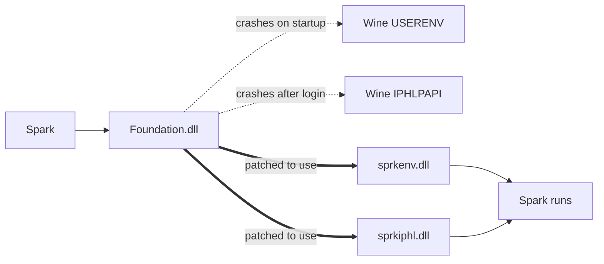
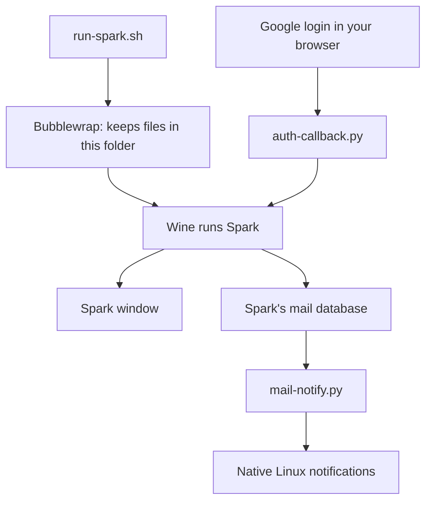
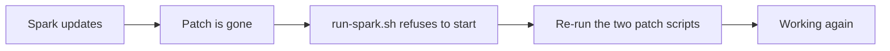

# spark-mail-linux

[Spark Mail](https://sparkmailapp.com/) has no Linux app. This makes the Windows
one work under Wine.

**Status: working.** Tested on Spark Desktop 3.30.10 and 3.30.11, Wine 11.16,
Arch Linux.

Login, inbox, calendar, sending, attachments and notifications all work.

Spark Desktop 3.30.12.140844 (2026-09-10) also passes a startup check with both
Wine patches. Mail, calendar, and attachment operations need separate checks on
this version. See the [official release notes](https://sparkmailapp.com/spark3/win/changelog).

## What it does

Spark almost runs on Wine already. Two Windows APIs that Wine does not finish
implementing crash it, so two tiny stand-in DLLs answer those calls instead.



Nothing is installed system-wide. Everything lives in this one folder.

## Install

You need the official `Spark.exe` from sparkmailapp.com.

```bash
sudo pacman -S wine bubblewrap python libarchive clang llvm binutils libnotify

mkdir -p app && bsdtar -xf /path/to/Spark.exe -C app   # unpack Spark
OUT_DIR=app ./shims/build.sh                            # build the two DLLs
python3 shims/patch-foundation.py                       # point Spark at them
python3 shims/patch-iphlpapi.py
./install-handler.sh                                    # so Google login works
./run-spark.sh                                          # go
```

On Hyprland, hide Wine's stray tray tile:

```bash
cat share/hyprland-spark-tray.conf >> ~/.config/hypr/hyprland.conf
```

## How a launch works



Two things worth knowing:

- Google login opens your real browser, so the callback has to be handed back
  into Wine. `install-handler.sh` sets that up.
- Spark's Windows notifications do not render on Wine, so `mail-notify.py`
  watches Spark's own database and fires native ones instead.

Bubblewrap keeps files contained. It is not a security sandbox: Spark still has
your network and your display.

## When Spark updates

An update overwrites the patch. The launcher notices and refuses to start
rather than crashing, and tells you what to run.



```bash
python3 shims/patch-foundation.py
python3 shims/patch-iphlpapi.py
```

Skip Spark's own update button. Download the new installer, unpack it over a
fresh `app/`, copy both DLLs back in, then run the two scripts above.

## Caveats

- Unofficial and unsupported. Readdle has nothing to do with this.
- Spark sees no network adapters. Mail and calendar do not care.
- Notifications read Spark's database directly, so a future version could
  break them. They fail quietly.
- The file picker is Wine's own. It works, it just looks plain.

## Details

`docs/investigation.md` has the full story: the crash dumps, the disassembly,
and why each fix is the right one. Both crashes are really Wine bugs, and the
shims only work around them.

Working on this repo? Run `git config core.hooksPath .githooks` once. This
folder holds your live mailbox and login state, and the hook stops you
committing any of it.

## Legal

No Spark code and no Microsoft code is in this repository, only original
scripts. Spark Desktop belongs to Readdle. Get it from them and follow their
terms. The shims exist so an unmodified app can run on Wine.

MIT licensed. See `LICENSE`.
