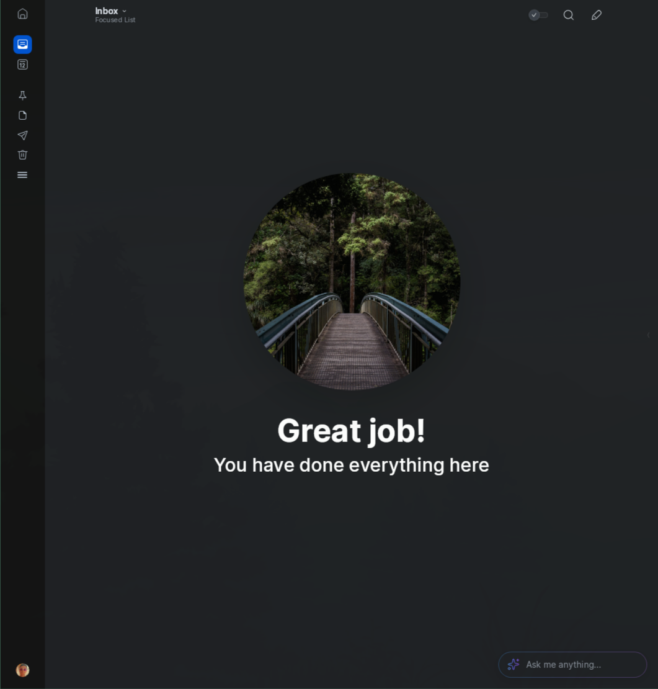
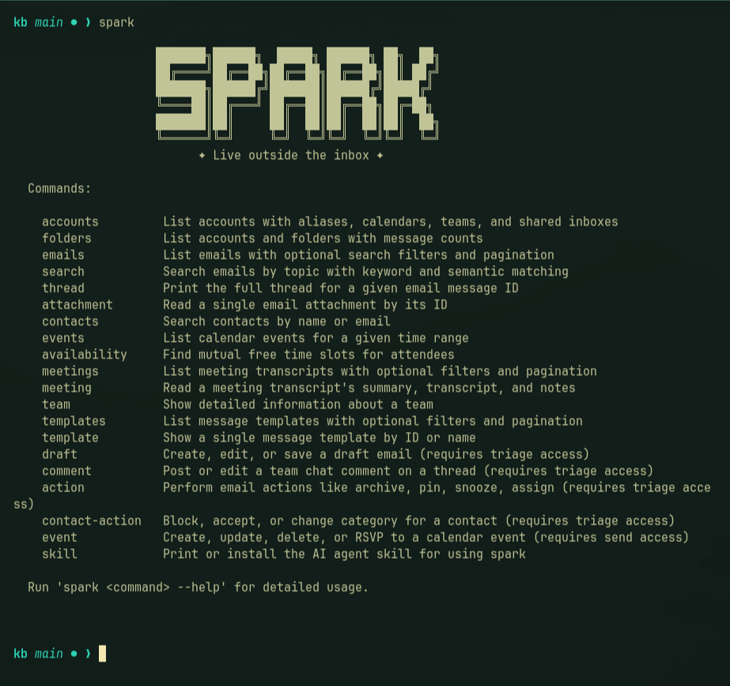
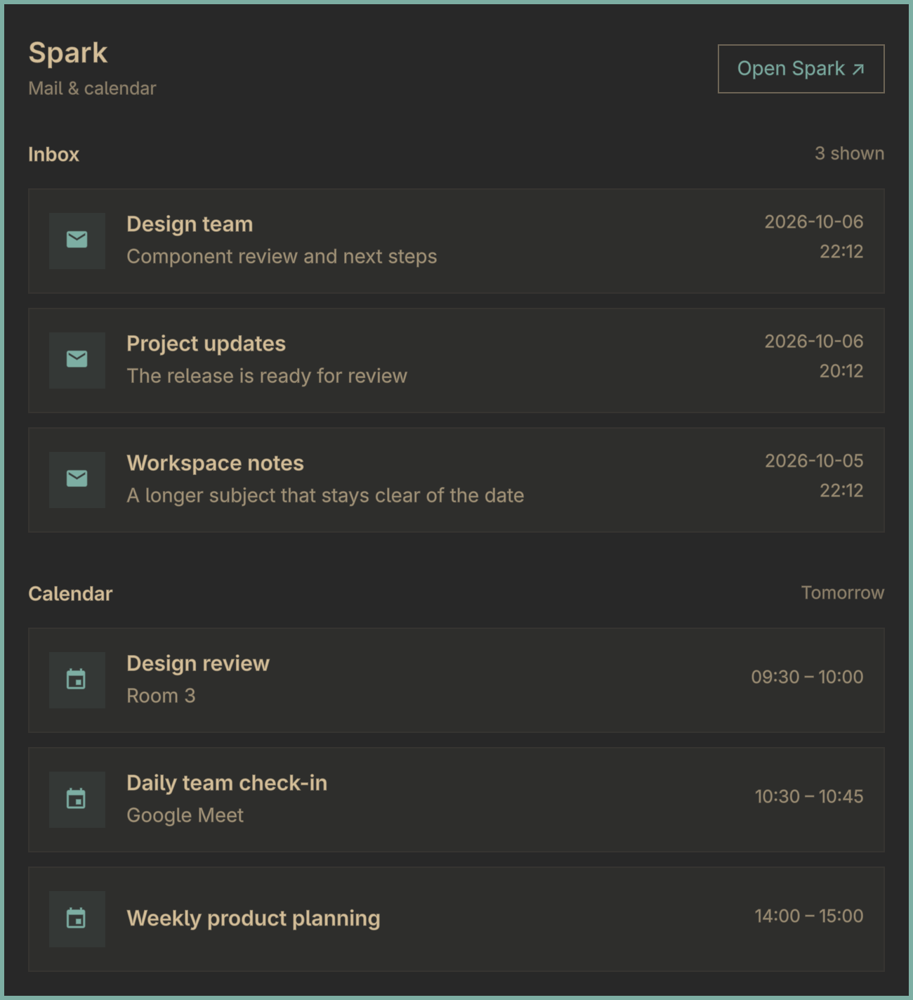
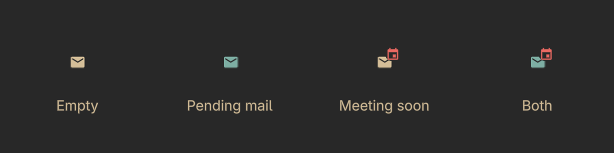
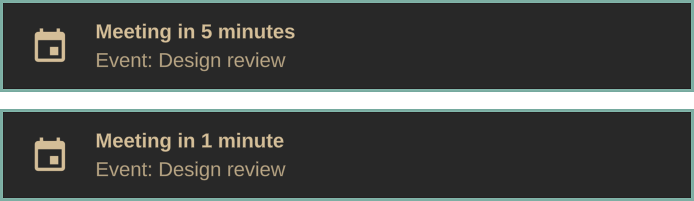

# spark-mail-linux

## TL;DR

Run [Spark Mail](https://sparkmailapp.com/) for Windows on Linux with Wine.
Two small DLL shims prevent known crashes. Scripts handle launch, browser login, and native notifications.

- **Unofficial.** Readdle does not support this project.
- **Verified:** Spark 3.31.5.141153 starts on Arch Linux with Wine 11.16.
- **CLI:** The bundled Windows CLI works through [bin/spark](bin/spark). Spark Desktop must remain open.
- **Updates:** Follow the [update procedure](AGENTS.md#update-spark), not Spark’s update button.



## Install

See [INSTALLATION.md](INSTALLATION.md) for full instructions, verification steps, caveats, and troubleshooting.
The recommended way to install is to give this repository to a coding agent. The installation document is written for that.

The short path on Arch Linux:

1. Download the official Windows `Spark.exe`. Confirm the current version and URL on the [release notes](https://sparkmailapp.com/spark3/win/changelog).
2. Run `./install.sh /path/to/Spark.exe` from the repository root.
3. Launch with `./run-spark.sh`. Use that command for later launches too.

The app and Wine state stay in this directory. The installer adds a normal
application launcher and registers Spark for browser callbacks, deep links,
and `mailto:` links with your desktop.

Web links use the host desktop portal to open your default browser with its existing profile.
This requires `python-gobject`, `xdg-desktop-portal`, and a portal backend for your desktop.
Omarchy already provides the portal backend.

After Spark's renderer is ready, the launcher hides Wine's tray window.
It keeps `explorer.exe` active because that process manages the clipboard.
Wine then shares copied text with the desktop clipboard through XWayland.
On Hyprland, an optional image watcher adds the Windows `CF_DIB` format when
the host clipboard contains only an image and Spark has focus. It handles
PNG, JPEG, GIF, TIFF, and other images that GdkPixbuf can decode, including
WebP. This lets Spark paste images with `Ctrl+V`. It needs `winegcc` to build,
plus `hyprctl`, `wl-paste`, and GdkPixbuf at runtime. Existing installations can build it with
`./bin/build-clipboard-image.sh`, then restart Spark. Clipboard selections
with text, HTML, or file lists are left alone. Files copied from the file
manager are exposed to Spark through Wine's `CF_HDROP`; compatible files can
be attached with `Ctrl+V` without image conversion.

The tray helper requires `xprop` and `libX11`.
If Spark already runs, quit Spark fully and launch it again with `./run-spark.sh` to apply these changes.

## What works

Login, inbox, calendar, mail delivery, attachments, and notifications were tested on Spark 3.30.10 and 3.30.11.
Version 3.30.12 has passed desktop startup checks. Its mail, calendar, and attachment operations still need separate checks.
Version 3.31.1 has passed desktop startup, notification watcher, and read-only CLI checks. Its mail, calendar, and attachment operations still need separate checks.
Version 3.31.2 has passed desktop startup, notification watcher, and read-only CLI checks. Its mail, calendar, and attachment operations still need separate checks.
Version 3.31.3 has passed desktop startup, notification watcher, and read-only CLI checks. Its mail, calendar, and attachment operations still need separate checks.
Version 3.31.4.141104 has passed desktop startup, notification watcher, and read-only CLI account checks with CLI 1.3.1.
Version 3.31.5.141153 has passed desktop startup, notification watcher, and read-only CLI account checks with CLI 1.4.0.
The host browser check passes, and host clipboard text matches Wine's clipboard when Spark has focus.
PNG image paste with `Ctrl+V` passed on Hyprland after the image watcher added `CF_DIB`.
Wine passed one file copied from the file manager to Spark as `CF_HDROP`, and Spark attached it with `Ctrl+V`.
Its mail, calendar, attachments, notification delivery, and both message copy actions still need separate checks.

Bubblewrap contains filesystem writes but retains network and display access. It is not a security sandbox.
If an existing Wine installation only starts with its original home and temporary directories, create an ignored
`spark.local.env` containing `SPARK_CONTAINER=0`. The launcher also accepts `SPARK_APP` and `SPARK_PREFIX` there,
so an existing installation can be adopted without copying its non-relocatable Wine prefix.
Notifications depend on Spark’s database format, which future updates can change. File dialogs use Wine’s interface.
The installer adds fallback Wine associations for unassociated DOC, DOCX, XLS, XLSX, PPT, PPTX, ODT, ODS, ODP,
CSV, and TSV attachments, while preserving existing Windows handlers. Registering XLSX stopped a click from closing
Spark on the reference installation. Opening that attachment in the host default application remains unresolved.
For existing installations, quit Spark fully and run `./bin/register-host-filetypes.sh` once.
The launcher disables optional PowerShell hardware probes. A PowerShell installation in a reused Wine prefix can
otherwise open many Wine debugger dialogs; Spark continues without that diagnostic hardware metadata.

## Spark CLI



Start Spark Desktop and enable account access under **Settings > AI Agents**.
Then run:

```bash
./bin/spark --help
./bin/spark --version
./bin/spark accounts
```

CLI 1.4.0 passed checks for help, version, accounts, folders, and emails. Data commands returned live results with read-only access.
Triage and send operations were not tested. They require a suitable plan and account permissions.

To put `spark` on your PATH, run these commands from the repository root:

```bash
mkdir -p ~/.local/bin
ln -s "$PWD/bin/spark" ~/.local/bin/spark
```

Ensure `~/.local/bin` is on your PATH. The command refuses to replace an existing file.
The wrapper uses the desktop’s Wine environment and skips the notification watcher.
See [CLI maintenance](AGENTS.md#spark-cli) for agent skills and update checks.

## Omarchy plugin

The optional plugin puts the unified inbox and calendar in the Omarchy bar.
Click an email to open its thread. Click an event to open Spark's calendar.



- Emails and events share a card layout, with a fixed header and a popup that grows to 80% of the screen height.
- Event cards show the location or conference provider. Events without either hide the second line.
- The mail icon uses the theme accent when emails remain in the inbox, including read emails.
- A separate calendar badge appears 15 minutes before an event.
- Native reminders fire five minutes and one minute before timed events. Calendar changes update or cancel the queued reminders.

The bar states are empty inbox, pending mail, an upcoming event, and both indicators together:



Calendar reminders use Omarchy's notification cards:



The screenshots use sample data. They contain no mailbox or account details.

The plugin requires Omarchy, Hyprland, and Spark Desktop with CLI read access.
Run the optional installer from the repository root:

```bash
./integrations/omarchy/install.sh
```

See [the plugin guide](integrations/omarchy/README.md) for reminders, settings, and checks.
Keep Spark's calendar notifications enabled until a real meeting confirms the new reminders.

To regenerate the screenshots after a UI change, run:

```bash
python3 integrations/omarchy/preview/render.py
```

The command renders the real widget with a mock helper. It reads no Spark data and schedules no reminders.

## Update

Updates replace the patched DLL. The launcher detects missing patches and refuses to start.

Follow [AGENTS.md](AGENTS.md#update-spark) to download, prepare, back up, replace, and verify a new version.
The procedure includes rollback steps and keeps your existing account state.

## Work on this project

Read [AGENTS.md](AGENTS.md) for the project map, work rules, and maintenance procedures.
`CLAUDE.md` links to the same file. Both people and coding tools use one set of instructions.

Enable the commit guard:

```bash
git config core.hooksPath .githooks
```

Never commit app binaries, mailbox data, credentials, or logs.
See [the investigation](docs/investigation.md) for the Wine failures and the reasons for each shim.

## License

The project scripts use the [MIT license](LICENSE).
Spark belongs to Readdle. Download it from them and follow their terms.
This repository contains no Spark or Microsoft code.
